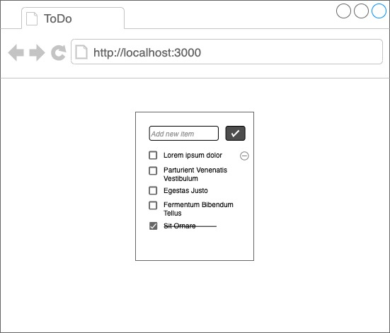

= React Assignment

=== General rules and requirements

* use any npm package you find appropriate
* ask questions when in doubt what we expect
* when you are not able to solve something in reasonable amount of time, write an explanation of why
(what knowledge is missing, why it needs so much time, etc.)
* write a Readme file with all information required to run in locally + all additional information you find worthy to share
* where we don't ask for any specific tool/coding approach, use any according to your preferences.
You may write a brief explanation of your choice
* you should not spend with our assignment more than 6 hours

=== Time for finishing
* first read the assigment and make clear you understand what we ask for
* try to estimate the time you require to finish it
* email us your estimation and a date, where you expect to be done.
Aim for realistic date and keep in mind all other responsibilities you may have
(your current work, family duties, vacation or public holidays)

== App description
We are going to ask you for just another ToDo list app.
The app have only one page showing list of all todos as you may see on following wireframe.

=== Functional requirements:
. You may add a new todo item using the form on the top.
. Items are sorted. Rules are: first open, then closed. Open items are then sorted alphabetically.
Closed items are sorted by date, most recently closed are first.
. Clicking a checkbox of an open item marks it done.
Checkbox and text appearance changes and the item moves from open items into closed.
. Clicking a checkbox of closed item reopen it again.
. On mouse hover, a remove icon appears (see "Lorem ipsum dolor" item). Clicking on the icon removes the item.
. Changes in items should be persistent between browser refresh (more robust persistence is not required)
. Open item can be edited by clicking on its text. Reuse the form for creating new items. Closed items can't be edited.

Feel free to use https://jsonplaceholder.typicode.com or any similar service as an API.
But definitely do use some API service. It doesn't matter whether the API runs remotely or locally.

=== Non-functional requirements
. Use functional components and not class based components
. Use react hooks where appropriate
. (optional, but preferred) Use either Flow or TypeScript

=== Additional tasks
These tasks are kind of optional. But please try to finish as much of them as you can.
When we ask to use some approach, design pattern or tool you are not familiar with, we encourage you to give it a try.
We will really appreciate when you try to use something new to you in this assignment.

. Implement Higher Order Component (HOC) `withLogging`. Any wrapped component logs its mounts, unmounts and renders to console.
. Use async/await for at least one method calling API.
. Use React Context as a data store (instead of using tools like Redux)
